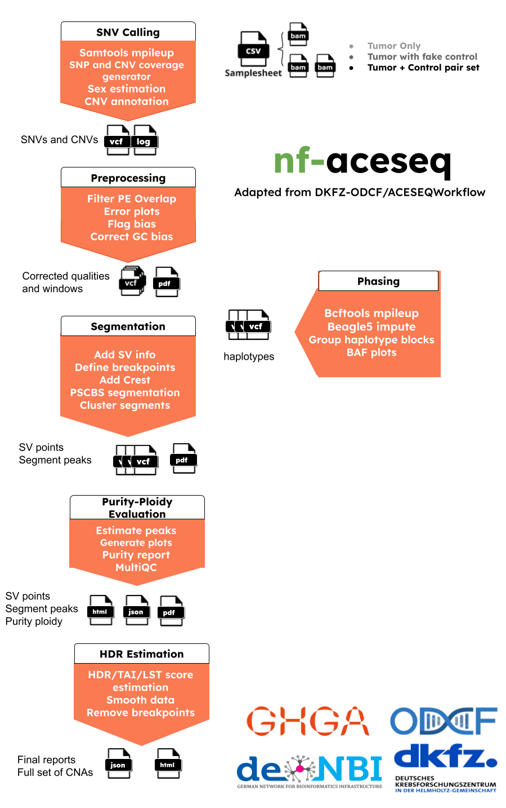

[](https://www.nextflow.io/)
[](https://www.docker.com/)
[](https://sylabs.io/docs/)

<p align="center">
    
</p>

## Introduction

**nf-aceseq** is a bioinformatics best-practice analysis pipeline for ACEseq Allele-specific copy number estimation adapted from [**ODCF-OTP ACEseqWorkflow**](https://github.com/DKFZ-ODCF/ACEseqWorkflow).

ACEseq (Allele-specific copy number estimation with whole genome sequencing) is a tool to estimate allele-specific copy numbers from human Whole Genome Sequencing data (>30X) using a tumor vs control paired data, and comes along with a variety of features:

- GC/replication timing Bias correction
- Quality check
- SV breakpoint inclusion
- Automated estimation of ploidy and tumor cell content
- HRD/TAI/LST score estimation
- With/without matched control processing
- Replacing bad control

For more information on theoretical part please refer to the orijinal documentation of the pipeline [here](https://aceseq.readthedocs.io/en/latest/index.html).

This workflow is not optimal to use with Whole Exome Sequencing data!

For now, this workflow is only optimal to work in ODCF Cluster. The config file (conf/dkfz_cluster.config) can be used as an example.

The pipeline is built using [Nextflow](https://www.nextflow.io), a workflow tool to run tasks across multiple compute infrastructures in a very portable manner. It uses Docker/Singularity containers making installation trivial and results highly reproducible. The [Nextflow DSL2](https://www.nextflow.io/docs/latest/dsl2.html) implementation of this pipeline uses one container per process which makes it much easier to maintain and update software dependencies.

## Pipeline summary

<!-- TODO nf-core: Fill in short bullet-pointed list of the default steps in the pipeline -->

The pipeline has 7 main steps:

1. **SNV calling** using mpileup
2. **Preprocessing** is part of quality control to correct biases in GC/replication timing
3. **Phasing** using beagle5
4. **Segmentation** with support of SV breakout inclusion.
5. **Purity-Ploidity prediction**, plot and report production
6. **HDR estimation** as well as TAI and LST
7. ([`MultiQC`](http://multiqc.info/)) is used to present QC for raw reads

- [SNV Calling](#snvcalling) - samtools mpileup part generates genotype likelihoods at each genomic position with coverage. Then, custom python scrtipy returns base counts of A and B allele of control and tumor, if there is coverage in either one (A allele is reference base) and it returns coverage in 1kb bins of control and tumor, if there is coverage in either one. Then, mappabilities of those regions are annotated. Those parts run in parallel per chromosome, finally SNP and coverage data are merged. Regions without coverage or SNP information are discarded.
- [Preprocessing](#preprocessing) - Then, SNV calls are used to correct for gc bias and replication timing starting from tumor and control read counts in 10kb windows. The two bias correction steps described above are done sequentially. A simultaneous 2D LOWESS or LOESS correction would be desirable, but fails due to computational load (the clusters to be fitted have 106 points). Different parameters such as slope and curvature of the both LOWESS correction curves used are extracted. The GC curve parameters is used as quality measures to determine the suitability of the sample for further analysis whereas the replication timing curve parameters is used to infer the proliferation activity of the tumor. We could show a strong correlation between Ki-67 estimates and the slope of the fitted curve.
- [Phasing](#phasing) - Phasing for female and male samples is seperated. bcftools mpileup generates likelihoods at each genomic position with coverage using control samples. For samples without control, coverages are generated from tumor samples only and unphased genotypes are created from known SNPs. Then phasing - imputation- is performed using beagle5 tool. Then, haplotype blocks are grouped obtained with imputation a haplotype group start at first phased SNP after an unphased SNP and is ended with the next occuring unphased SNP. Counts are then adjusted for allele frequencies based on imputation results. Thus, the median tumor BAF is calculated haploblock-wise for all SNP positions that are heterozygous in the control. If it is below 0.5 A- and B-allele are swapped within the haploblock region to get consistency across the haploblocks of a segment. This procedure ensures a more accurate estimation of the allelic state of a region in the next step.
- [Segmentation](#segmentation) - Once data pre-processing is completed the genome is segmented with the PSCBS (parent specific circular binary segmentation) algorithm. Prior to the actual segmentation, segment-boundaries due to a lack of coverage are determined. Single outliers among the coverage and very low coverage regions are determined using PSCBS functions. In addition to these, breakpoints that are indicated by previously called structural variations are taken into account. During the actual segmentation step the genome is segmented based on the pre-defined breakpoints, changes in the coverage ratio and DH. DH values are only considered in case the SNP position is heterozygous in the control. Homozygous deletions are called in segments that lack mapped reads. These deletions are only considered to be true in case the low read count is unlikely to be caused by a low mappability. Thus, the mappability is assessed for all segments. Regions with mappbility below 60% are considered unmappable and not further considered for copy number estimation. Each SNP position is annotated with the new segment information and mappability. In order to avoid over-segmentation short segments (default <9 kb) are attached to the closest neighboring segment according to the coverage ratio. Subsequently, segments from diploid chromosomes are clustered according to the log2 of the coverage ratio and DH. These values are scaled prior to clustering. The DH of a segment is defined as the most commonly found DH value among all SNPs in the segment that are heterozygous in the control. To avoid over-fitting a further downstream processing is applied. Firstly, the minimal accuracy defined by the FWHM is taken into account. Cluster with more than 85% of all points within these coverage limits are chosen. Of these the cluster with most segments is defined as main cluster. The other chosen clusters are merged with the main cluster if their the difference between their center and the main cluster center is not bigger than XX times the DH-MAD of the main clusters. Neighboring segments are merged before new cluster centers are determined. In a second step segments that are embedded within main cluster segments are considered for merging. The number of control heterozygous SNP positions and the length are considered here to establish two criteria. Segments with less than 5 heterozygous SNPs are merged with the main cluster if they lie between the FWHM boundaries. If the SNP error of a selected segment exceeds the distance in DH and the length error exceeds the coverage difference it is appointed to the main cluster. Again neighboring segments with identical clusters are merged. Finally, a general cluster coverage is estimated from all relevant segments and assigned to the cluster members to further reduce noise in the data.
- [Purity Evaluation](#purityevaluation) - Once the allelic state of a segment is determined it can be used for the computation of tumor cell content and ploidy of the main tumor cell population. The average observed tumor ploidy can be determined with equation. To obtain actual copy numbers for each segment ploidy and tumor cell content of the tumor sample have to be inferred from the data. Information about the allelic state of a segment is combined with TCN, DH and allele-specific copy numbers calculations. The combination of ploidy and tumor cell content that can explain the observed data the best is to be found. Possible ploidies in the range from 1 to 6.5 in steps of 0.1 and possible tumor cell content from 30% to 100% in steps of 1% are tested. The evaluation is done based on the distance of all segments from their next plausible copy number state. Imbalanced segments are fitted to a positive integer value.
- [HDR estimation](#hdrestimation) - Once the optimal ploidy and tumor cell content combinations are found the TCN and allele-specific CN will be estimated for all segments in the genome and classified (gain, loss, copy-neutral LOH, loss LOH, gain LOH, sub). If a segments TCN is further than 0.3 away from an integer value it is assumed to originate from subpopulations in the tumor sample that lead to gains or losses in part of the tumor cell population.

## Running pipeline with different modules:

- Running with no control samples or with bad control samples

To be able to run with fake control ACE-Seq pipeline must be already processed with some other tumor-normal pairs. Then, its coverage profile can be used for normalization for nocontrol or bad control samples. In this case, no BAFs can be used from a matching control sample, and also patients sex would not be inferred. In order to use this functionality, --fake_control and --fake_control_prefix must be defined.

For the configuraton, the path and the prefix to the control coverage profile for a male or a female patient must be matched: fake_control file directory must be organized such that: {fake_control_prefix}.chr*.cnv.anno.tab.gz for hg38 or {fake_control_prefix}.*.cnv.anno.tab.gz for hg37. For female samples chromosome list should be 1-22,X and for male samples chromosome list should be 1-22,X,Y.

If there is no control, **automatically** nocontrol workflow will be switched on. In order to use nocontrol workflow, sex must be defined in metadata.

Nocontrol behaviour of this workflow uses a fake control. In order to use this functionality, --fake_control and --fake_control_prefix must be defined.

As an important note: running with Fake Control (or no control mode) cannot be executed in the same time with normal run mode (without fake control replacement)

- Running only for Quality Control

--runQualityCheckOnly true
runs **only** SNV calling and preprocessing

- Running with or without Structural Variants SVs

In order to integrate SV processing,A file path contaning Structural Variants must be provided in the samplesheet.

- Sex estimation

Sex is an important part of this workflow, if there is no control file, sex cannot be estimated through pipeline and thus must be given through samplesheet.

--estimatesex
If it is false, sex estimation will not run and user given sex is used. To do so, samplesheet must include sex column filled.

## How to prepare files

This workflow uses Beagle5 for imputing. Beagle uses 2 types of reference files:

- Preperation of generic maps:

Appropriate version of the genetic map can be downloaded [here](https://bochet.gcc.biostat.washington.edu/beagle/genetic_maps/)

Data processing must be done as follows:

```console
version="38/37/36"
for chr in `seq 1 22` X ; do cat plink.chr${chr}.GRCh${version}.map | sed 's/^/chr/' > plink.chr${chr}.GRCh${version}.CHR.map; done
```

- Preperation of reference files:

An example on how the reference files for beagle are prepared can be found [here](https://bochet.gcc.biostat.washington.edu/beagle/1000_Genomes_phase3_v5a/READ_ME_beagle_ref). Be carefull to prepare the same version of reference file used for SNV calling through bcftools mpileup!

## Quick Start

1. Install [`Nextflow`](https://www.nextflow.io/docs/latest/getstarted.html#installation) (`>=22.10.1`)

2. Install any of [`Docker`](https://docs.docker.com/engine/installation/), [`Singularity`](https://www.sylabs.io/guides/3.0/user-guide/) (you can follow [this tutorial](https://singularity-tutorial.github.io/01-installation/)) for full pipeline reproducibility _(you can use [`Conda`](https://conda.io/miniconda.html) both to install Nextflow itself and also to manage software within pipelines. Please only use it within pipelines as a last resort; see [docs](https://nf-co.re/usage/configuration#basic-configuration-profiles))_.

3. Download the pipeline and test it on a minimal dataset with a single command:

   ```console
   git clone https://github.com/ghga-de/nf-aceseq.git
   ```

   before run do this to bin directory, make it runnable!:

```console
chmod +x bin/*
```

```bash
nextflow run main.nf -profile test,YOURPROFILE --outdir <OUTDIR> --input <SAMPLESHEET>
```

Note that some form of configuration will be needed so that Nextflow knows how to fetch the required software. This is usually done in the form of a config profile (`YOURPROFILE` in the example command above). You can chain multiple config profiles in a comma-separated string.

> - The pipeline comes with config profiles called `docker` and `singularity` `which instruct the pipeline to use the named tool for software management. For example,`-profile test,docker`.
> - Please check [nf-core/configs](https://github.com/nf-core/configs#documentation) to see if a custom config file to run nf-core pipelines already exists for your Institute. If so, you can simply use `-profile <institute>` in your command. This will enable either `docker` or `singularity` and set the appropriate execution settings for your local compute environment.
> - If you are using `singularity`, please use the [`nf-core download`](https://nf-co.re/tools/#downloading-pipelines-for-offline-use) command to download images first, before running the pipeline. Setting the [`NXF_SINGULARITY_CACHEDIR` or `singularity.cacheDir`](https://www.nextflow.io/docs/latest/singularity.html?#singularity-docker-hub) Nextflow options enables you to store and re-use the images from a central location for future pipeline runs.

4. Start running your own analysis!

   <!-- TODO nf-core: Update the example "typical command" below used to run the pipeline -->

   ```bash
    nextflow run main.nf --input samplesheet.csv --outdir <OUTDIR> -profile <docker/singularity> --config test/institute.config
   ```

## Samplesheet columns

**sample**: The sample name will be tagged to the job

**sex**: The sex of the sample (male, female or klinefelter), It is only mandatory for nocontrol samples. Keep it blank to enable sex estimation.

**sv**: The path to file with structural variants, if there is no SV file will be kept blank.

**tumor**: The path to the tumor file.

**tumor_index**: The path to the tumor index file.

**control**: The path to the control file, if there is no control will be kept blank.

**contro*index***: The path to the control index file, if there is no control will be kept blank.

## Data Requirements

## Documentation

The nf-aceseq pipeline comes with documentation about the pipeline [usage](https://github.com/ghga-de/nf-aceseq/usage), [parameters](https://github.com/ghga-de/nf-aceseq/parameters) and [output](https://github.com/ghga-de/nf-aceseq/output).

## Credits

nf-aceseq was originally written by kuebra.narci@dkfz-heidelberg.de.

This pipeline is adapted from [**ODCF-OTP ACEseqWorkflow**](https://github.com/DKFZ-ODCF/ACEseqWorkflow).

## Contributions and Support

If you would like to contribute to this pipeline, please see the [contributing guidelines](.github/CONTRIBUTING.md).

## Citations

<!-- TODO nf-core: Add citation for pipeline after first release. Uncomment lines below and update Zenodo doi and badge at the top of this file. -->
<!-- If you use  nf-core/aceseq for your analysis, please cite it using the following doi: [10.5281/zenodo.XXXXXX](https://doi.org/10.5281/zenodo.XXXXXX) -->

<!-- TODO nf-core: Add bibliography of tools and data used in your pipeline -->
